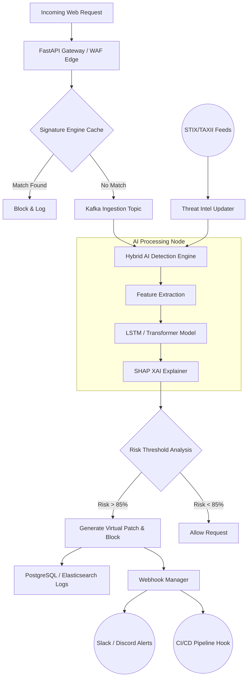

# Vyntrix Intelligence: Technical Specification & Architecture Roadmap

**Role:** Lead AI Security Engineer & System Architect
**Project:** Vyntrix Intelligence - Advanced AI Ecosystem for Web Security and Threat Detection

---

## 1. Executive Summary
Vyntrix Intelligence is a next-generation web security ecosystem that leverages a hybrid AI-driven detection engine to identify, explain, and mitigate both known and zero-day threats in real-time. By combining deep learning models with explainable AI (XAI) and dynamic threat intelligence, Vyntrix provides unprecedented visibility, trust, and automated remediation for modern web applications.

---

## 2. Recommended Tech Stack
To ensure high throughput, low latency, and robust machine learning capabilities, the following technology stack is recommended:

*   **Core Systems & API:** Python 3.11+, FastAPI (for high-performance async APIs)
*   **Machine Learning:** PyTorch (for LSTM/Transformers), SHAP (for Explainable AI), Scikit-learn
*   **Data Streaming & Message Broker:** Apache Kafka (for real-time request ingestion and async processing)
*   **Databases:**
    *   **PostgreSQL:** Relational data (users, configurations, audit logs).
    *   **Redis:** Caching, rate limiting, and fast threat-intel lookups.
    *   **Elasticsearch / OpenSearch:** Log aggregation, search, and anomaly visualization.
*   **Threat Intelligence Integration:** TAXII Clients for STIX data schema parsing.
*   **Infrastructure & Deployment:** Docker, Kubernetes, GitHub Actions (CI/CD).

---

## 3. Data Flow Diagram
The following Mermaid diagram illustrates the lifecycle of an incoming web request through the Vyntrix ecosystem.

---

## 4. Core Architecture Pillars

### I. Hybrid Detection Engine
The detection engine operates on a multi-layered approach to guarantee both speed and accuracy.
*   **Signature-Based Detection (Layer 1):** Utilizes highly optimized RegEx and known CVE signatures to block established threats instantly with ~0ms latency.
*   **Behavioral Anomaly Detection (Layer 2):** Sequences of HTTP requests (headers, payload structures, access patterns) are processed via **Transformers or LSTM networks**. This layer catches Zero-Day exploits by detecting deviations from the baseline of legitimate traffic.
*   **Real-time Threat Intelligence:** A background cron-worker ingests global threat intelligence feeds using **STIX/TAXII protocols**, dynamically updating the model's localized knowledge base with the latest malicious IP subnetworks, payload signatures, and attack campaigns.

### II. Transparency & Trust (Explainable AI - XAI)
To build trust with security operations (SecOps) teams, Vyntrix avoids the "black box" AI problem.
*   **SHAP Values Integration:** Every request flagged by the AI model is passed through a SHAP (SHapley Additive exPlanations) explainer.
*   **Human-Readable Risk Factors:** The system translates mathematical feature importance into actionable intelligence.
    > [!NOTE]
    > **Example Output:** "98% probability of SQL Injection. Critical features: Highly encoded 'OR 1=1' pattern identified in the 'username' POST parameter, originating from an anomalous IP range."

### III. Developer Ecosystem
Built for seamless integration into modern DevSecOps environments.
*   **High-Performance API:** Built with **FastAPI**, offering asynchronous request handling, protected by robust **JWT authentication** and Role-Based Access Control (RBAC).
*   **Webhook Alerting System:** Real-time event dispatchers configured to push critical alerts (JSON payloads) to **Slack, Discord**, or custom HTTP endpoints.
*   **CI/CD Integration:** API endpoints designed to be polled via GitHub Actions or GitLab CI, enabling security gating (e.g., blocking a deployment if the staging environment shows high vulnerability exposure based on Vyntrix scans).

### IV. Advanced Security Features

*   **Self-Healing Protocols (Virtual Patches):** 
    When the Hybrid Engine detects a new, uncategorized attack pattern repeatedly targeting a specific endpoint, Vyntrix dynamically generates a restrictive WAF rule (a "Virtual Patch"). This patch is automatically deployed to the Edge API to block the attack vector temporarily while alerting developers to fix the underlying code vulnerability.
*   **Adversarial Robustness:**
    *   *Prompt/Payload Injection protection:* The AI sanitizes all inputs using strict token limiters and semantic structure enforcement before feeding them into the deep learning model.
    *   *Model Evasion protection:* The model is periodically retrained using **Adversarial Training** techniques—feeding it intentionally obfuscated or mutated payloads (e.g., bypassing standard SQLi filters) to harden its decision boundaries against sophisticated evasion attacks.

---

## 5. Implementation Roadmap (Phases)

### Phase 1: MVP (Foundation & Basic Detection)
*   Setup FastAPI architecture and PostgreSQL database schemas.
*   Implement JWT authentication and basic developer API endpoints.
*   Integrate the Signature-based engine for common OWASP Top 10 threats.
*   Establish basic logging and request blocking mechanisms.

### Phase 2: Advanced AI & XAI Integration
*   Develop and train the underlying LSTM/Transformer models on benign and malicious HTTP datasets (e.g., CSIC 2010, custom generated datasets).
*   Deploy PyTorch models via standard endpoints.
*   Integrate SHAP libraries to generate the human-readable "Risk Factor" narratives for flagged payloads.
*   Implement Apache Kafka for asynchronous request processing to prevent API bottlenecks.

### Phase 3: Developer Ecosystem & Automation
*   Develop the Webhook Manager system.
*   Create Slack and Discord integration apps.
*   Build pipeline scripts and document usage for CI/CD integration.
*   Integrate STIX/TAXII polling services for dynamic threat intelligence updates.

### Phase 4: Enterprise Scale & Self-Healing
*   Implement the Self-Healing "Virtual Patching" engine.
*   Introduce Adversarial Training loops to harden the model.
*   Deploy Elasticsearch stack for advanced threat hunting dashboards.
*   Optimize system for high-availability distributed deployments across Kubernetes clusters.
